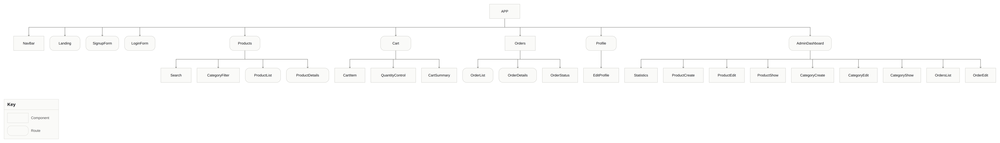

# Nomad

## Description

Nomad is a full-stack MERN e-commerce application for camping and adventure products. It gives users a simple way to browse outdoor equipment, search and filter products, add items to their cart, and place and manage orders.

The application also includes an admin side where store administrators can manage products, categories, and customer orders through a centralized dashboard.

We built Nomad to make it easier for people to find and purchase camping and outdoor equipment in one place.

## Planning Materials

### Trello Board

[Nomad Trello Board](https://trello.com/b/T0LI2wzk/unit3-project)

## User Stories

### Guest User Stories

* As a guest, I can view the home page explaining what the camping store offers.
* As a guest, I can view all available camping and adventure products.
* As a guest, I can search for camping products.
* As a guest, I can filter products by category.
* As a guest, I can view the details of a specific product.
* As a guest, I can view available product categories.
* As a guest, I can sign up for an account.
* As a guest, I can log in to my account.

### Customer / General User Stories

* As a user, I can log in to my account.
* As a user, I can log out of my account.
* As a user, I can view and edit my profile.
* As a user, I can add camping products to my cart.
* As a user, I can change the quantity of products in my cart.
* As a user, I can remove products from my cart.
* As a user, I can view my current cart before placing an order.
* As a user, I can place an order.
* As a user, I can view my previous orders.
* As a user, I can view the details and status of a specific order.
* As a user, I can cancel an order if it has not been processed.

### Admin User Stories

* As an admin, I can access an admin dashboard.
* As an admin, I can view order statistics.
* As an admin, I can create a new camping product.
* As an admin, I can edit a camping product.
* As an admin, I can delete a camping product.
* As an admin, I can create a product category.
* As an admin, I can edit a product category.
* As an admin, I can delete a product category.
* As an admin, I can view all customer orders.
* As an admin, I can update an order's status.
* As an admin, I can delete an order.

## ERD


## Wireframes


## Routes

### Auth Routes

| **HTTP Method** | **Controller** | **Response** | **URI**        | **Use Case**                     |
| --------------- | -------------- | -----------: | -------------- | -------------------------------- |
| POST            | signup         |          201 | `/auth/signup` | Create a new user account        |
| POST            | login          |          200 | `/auth/login`  | Login with username and password |

### User Routes

| **HTTP Method** | **Controller** | **Response** | **URI**          | **Use Case**             |
| --------------- | -------------- | -----------: | ---------------- | ------------------------ |
| GET             | getUser        |          200 | `/users/profile` | Get current user profile |
| PUT             | updateUser     |          200 | `/users/profile` | Update user profile      |
| DELETE          | deleteUser     |          200 | `/users/profile` | Delete user account      |

### Product Routes

| **HTTP Method** | **Controller** | **Response** | **URI**                | **Use Case**                 |
| --------------- | -------------- | -----------: | ---------------------- | ---------------------------- |
| POST            | createProduct  |          201 | `/products`            | Create a new camping product |
| GET             | getProducts    |          200 | `/products`            | List all camping products    |
| GET             | showProduct    |          200 | `/products/:productId` | Get a single product         |
| PUT             | updateProduct  |          200 | `/products/:productId` | Update a product             |
| DELETE          | deleteProduct  |          200 | `/products/:productId` | Delete a product             |

### Category Routes

| **HTTP Method** | **Controller** | **Response** | **URI**                   | **Use Case**          |
| --------------- | -------------- | -----------: | ------------------------- | --------------------- |
| POST            | createCategory |          201 | `/categories`             | Create a new category |
| GET             | getCategories  |          200 | `/categories`             | List all categories   |
| GET             | showCategory   |          200 | `/categories/:categoryId` | Get a single category |
| PUT             | updateCategory |          200 | `/categories/:categoryId` | Update a category     |
| DELETE          | deleteCategory |          200 | `/categories/:categoryId` | Delete a category     |

### Cart Routes

| **HTTP Method** | **Controller** | **Response** | **URI**            | **Use Case**               |
| --------------- | -------------- | -----------: | ------------------ | -------------------------- |
| POST            | addToCart      |          201 | `/cart`            | Add a product to cart      |
| GET             | getCart        |          200 | `/cart`            | Get current user's cart    |
| PUT             | updateCart     |          200 | `/cart/:productId` | Update product quantity    |
| DELETE          | removeFromCart |          200 | `/cart/:productId` | Remove a product from cart |

### Order Routes

| **HTTP Method** | **Controller** | **Response** | **URI**                   | **Use Case**                |
| --------------- | -------------- | -----------: | ------------------------- | --------------------------- |
| POST            | createOrder    |          201 | `/orders`                 | Place a new order           |
| GET             | getOrders      |          200 | `/orders`                 | List user's previous orders |
| GET             | showOrder      |          200 | `/orders/:orderId`        | Get a single order          |
| PUT             | cancelOrder    |          200 | `/orders/:orderId/cancel` | Cancel an unprocessed order |

### Admin Routes

| **HTTP Method** | **Controller** | **Response** | **URI**                  | **Use Case**             |
| --------------- | -------------- | -----------: | ------------------------ | ------------------------ |
| GET             | dashboard      |          200 | `/admin/dashboard`       | View order statistics    |
| GET             | getAllOrders   |          200 | `/admin/orders`          | List all customer orders |
| PUT             | updateOrder    |          200 | `/admin/orders/:orderId` | Update an order's status |
| DELETE          | deleteOrder    |          200 | `/admin/orders/:orderId` | Delete an order          |

## Component Hierarchy Diagram



## Getting Started

**Note**

Backend should be running at the same time as the frontend.

### Prerequisites

* Node.js and npm installed
* Nomad backend running locally

### Installation

Clone the repository

```bash
git clone https://github.com/fatema-maitham/nomad-frontend.git
```

Navigate into the project folder

```bash
cd nomad-frontend
```

Install dependencies

```bash
npm install
```

Create a `.env` file and set the backend API URL:

```env
VITE_BACK_END_SERVER_URL=http://localhost:3000
```

Start the development server

```bash
npm run dev
```

## Attributions


## Documentation


## Technologies Used

### Frontend

* React (Vite) – Frontend framework
* CSS – Styling
* JavaScript – Programming language
* React Router DOM – Routing between pages

### Backend

* Node.js – Runtime environment
* Express.js – Backend framework
* MongoDB – Database
* Mongoose – MongoDB object modeling
* JWT – Authentication and authorization
* bcrypt – Password hashing

## Future Enhancements

* Product reviews and ratings
* Wishlist functionality
* Online payment integration
* Order tracking
* Product recommendations
* Discount and coupon codes
